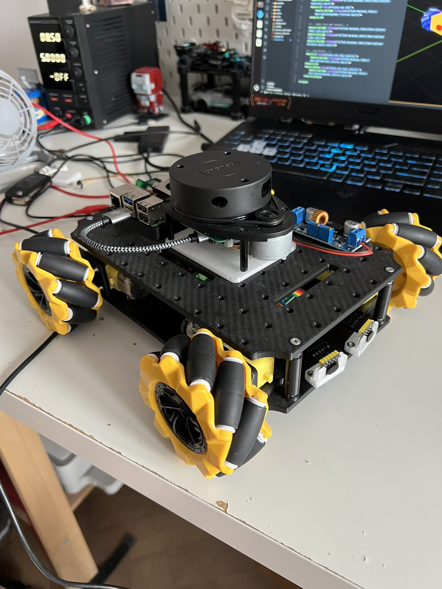
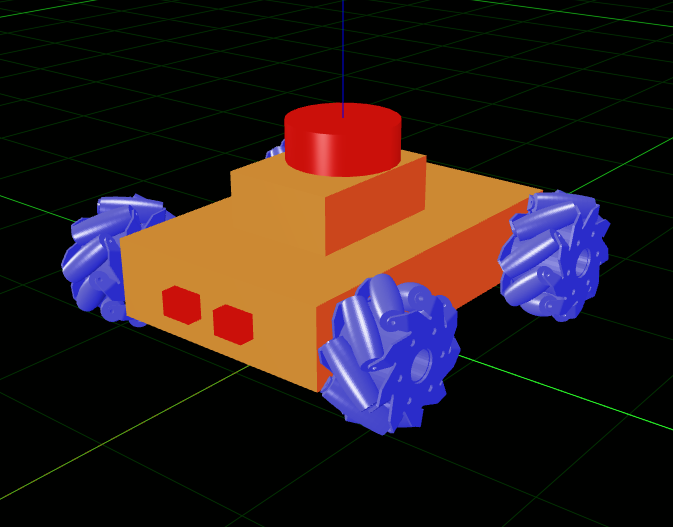
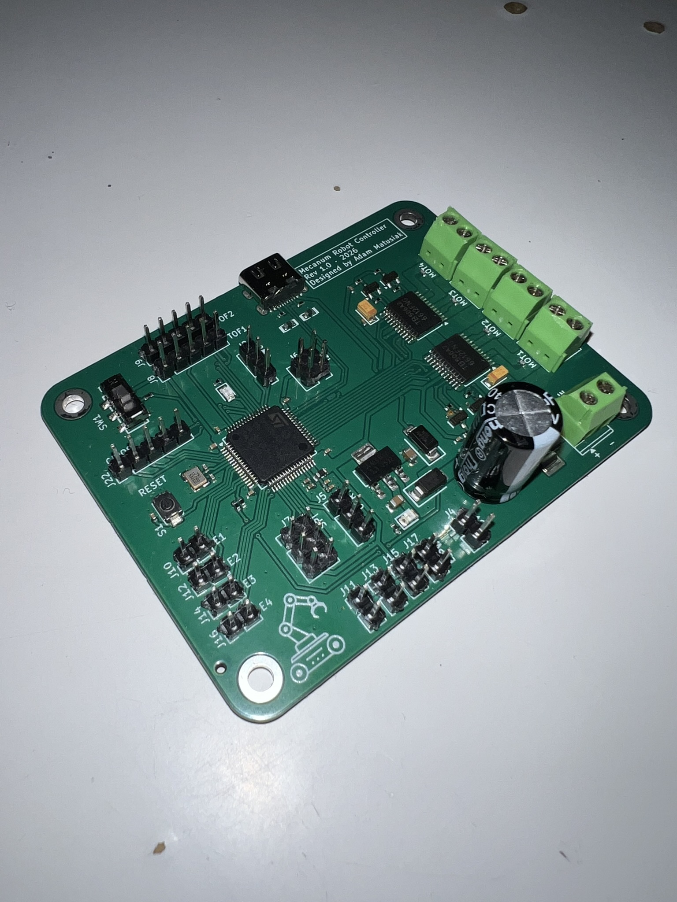

# Mecanum Robot

> **Work in progress** — this README will be updated as the project evolves.

<p align="center">
  
</p>

## Gallery

<p align="center">
  
  &nbsp;&nbsp;&nbsp;&nbsp;
  
</p>

## Overview

This project focuses on building a **mecanum-wheeled robot** capable of **autonomous navigation**. Mecanum wheels allow omnidirectional movement — the robot can move forward, backward, sideways, and rotate in place without changing its orientation, making it well-suited for tight spaces and complex navigation tasks.

## Goals

- Design and simulate a mecanum-drive robot in ROS 2
- Hardware integration with **ros2_control**
- Integrate sensors (e.g. LiDAR, camera) for environment perception
- Enable autonomous navigation using SLAM and path planning

## Based on

This project builds upon my previous work:  
**[RoMKoSz](https://github.com/adammat02/RoMKoSz)**

## Tech Stack

- **ROS 2** (Robot Operating System 2)
- **Gazebo** — simulation
- **URDF / Xacro** — robot description
- **Nav2** — autonomous navigation stack (planned)

## Installation

```bash
# 1. Clone into workspace
cd ~/ros2_ws/src
git clone <url> mecanum_robot

# 2. Fetch external packages from GitHub
cd ~/ros2_ws
vcs import src < src/mecanum_robot/mecanum_robot.repos

# 3. Install apt dependencies (including libserial-dev)
rosdep install --from-paths src --ignore-src -r -y

# 4. Build
colcon build --symlink-install
```

> `vcs` is available via `sudo apt install python3-vcstool`.

## Running on the Real Robot

### 1. On the robot (Raspberry Pi / onboard computer)

```bash
source ~/mecanum_ws/install/setup.bash
ros2 launch mecanum_robot launch_robot.launch.py
```

### 2. On the workstation — RViz

```bash
source ~/mecanum_ws/install/setup.bash
ros2 launch mecanum_robot rviz.launch.py
```

> Make sure `ROS_DOMAIN_ID` is the same on both machines and that they are on the same network.

---

### Mapping (building a new map)

On the workstation, launch SLAM Toolbox:

```bash
ros2 launch mecanum_robot online_async_launch.py use_sim_time:=false
```

Drive the robot around until the map is complete, then save it:

```bash
ros2 run nav2_map_server map_saver_cli -f ~/maps/my_map
```

---

### Localization & Navigation (using an existing map)

**Step 1 — localization (AMCL):**

```bash
ros2 launch mecanum_robot localization_launch.py \
  map:=/home/<user>/maps/my_map.yaml \
  use_sim_time:=false
```
In RViz, set the initial pose with **2D Pose Estimate**, then send a goal with **Nav2 Goal**.

**Step 2 — navigation (Nav2):**

```bash
ros2 launch mecanum_robot navigation_launch.py \
  use_sim_time:=false
```

---

### Joystick Controller

Works for both the real robot and simulation. Pass `use_sim_time:=true` when running in simulation.

```bash
ros2 launch mecanum_robot joy_controller.launch.py use_sim_time:=false
```

---

## Simulation (Gazebo)

Launches Gazebo, spawns the robot, starts ros2_control controllers, and opens RViz — all in one command:

```bash
ros2 launch mecanum_robot launch_sim.launch.py
```

To load a custom world:

```bash
ros2 launch mecanum_robot launch_sim.launch.py world:=/path/to/world.sdf
```

---

## To-Do

- Complete simulation support for range sensors
- Integrate range sensors into the Nav2 navigation stack (obstacle avoidance)

## License

Apache-2.0
